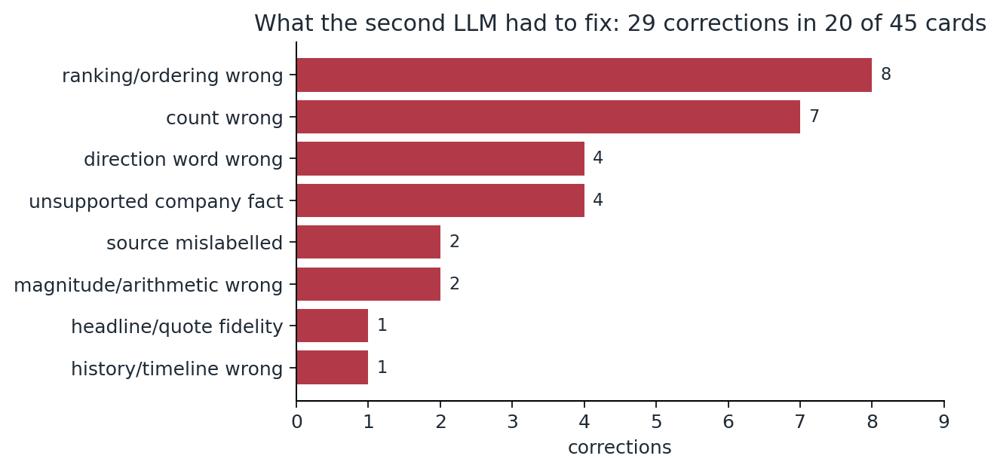
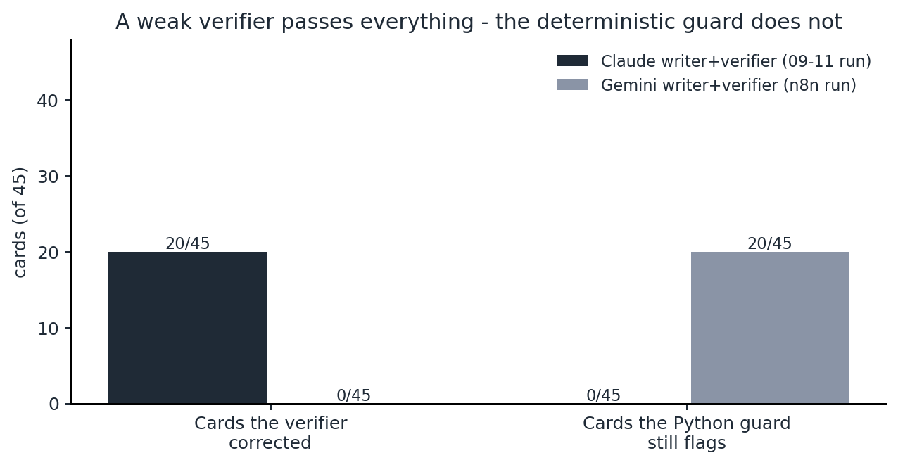
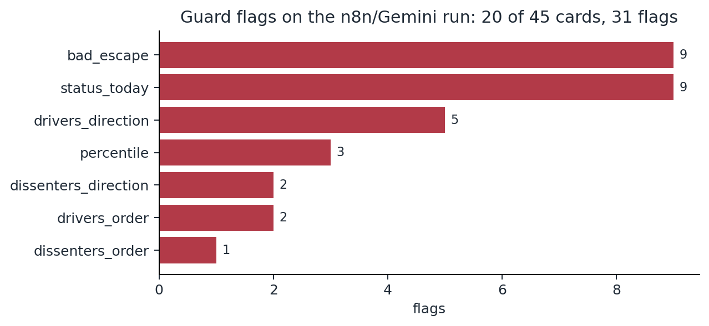
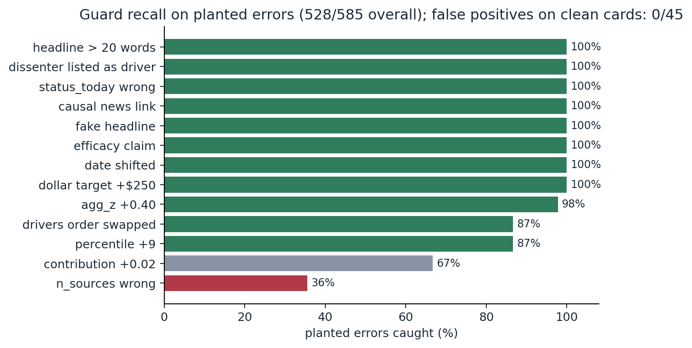
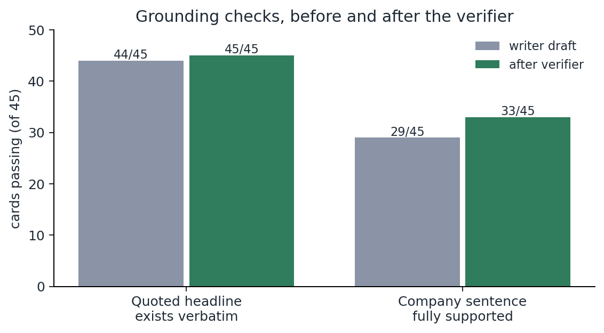

# Book Explainer — evaluation

MSBAi Module 3, AI Agents. Evidence for the claim that an explainability agent over a
live systematic book is only safe if a deterministic checker sits behind the LLMs.

All numbers below were produced by scripts in `eval/`; every figure is regenerated by
`python eval/make_figures.py`. Two complete runs over the same 45 positions are compared:

| Run | Writer | Verifier | Where |
|---|---|---|---|
| **A — reference** | Claude (Claude Code agents, 2026-09-11) | Claude | `run_2026-09-11/` |
| **B — the submitted system** | Gemini 3.5 Flash-Lite via n8n | Gemini 3.5 Flash-Lite via n8n | `runs/n8n_2026-09-11_full_*/` |

Same prompts, same input JSON, same guard. Run B is the deliverable; run A is the
quality reference we already had, and the labelled error set it produced is the
evaluation data for metric 1.

> **Model note.** The design targets Claude for the writer and verifier. The project's
> Anthropic key is unfunded, so the n8n workflow calls `gemini-3.5-flash-lite` (the
> Gemini key that exists). Everything downstream of the LLMs is identical. The gap
> between run A and run B is therefore a model-quality result, not a design change.

---

## 1. Draft error rate — why one LLM is not enough

In run A the verifier corrected **20 of 45 cards (44%)**, making **29 distinct
corrections**. Per batch: 6, 5, 4, 1, 4. Every correction is a labelled error in
`results/run_2026-09-11/problems_labelled.csv`.

| Error type | n | Example |
|---|---|---|
| ranking/ordering wrong | 8 | "its two largest sources vote against" — only the largest did |
| count wrong | 7 | "nine of ten sources vote long" — eight did |
| direction word wrong | 4 | score called "well inside" a threshold it had not breached |
| unsupported company fact | 4 | "pet nutrition", "maker of robotic surgical systems" — not in the background |
| source mislabelled | 2 | daily short-volume ratio described as the bi-weekly report |
| magnitude/arithmetic wrong | 2 | "has more than halved" — it retained 56% |
| headline/quote fidelity | 1 | a news headline quoted truncated |
| history/timeline wrong | 1 | "ran negative through late August" — 08-28 printed +0.111 |

**The shape of the errors matters more than the rate.** Almost none are mistyped
numbers; the writer copied percentiles and contributions correctly. What it got wrong
was *claims about* the numbers — counts, orderings, superlatives, direction words. That
is exactly the class a human skims past in a memo, and exactly what a naive
"check the digits" validator would miss.

## 2. Verifier recall — and what a weak verifier does

Running the deterministic guard (`eval/checks.py`, 14 checks) over the *verified* cards:

- Run A (Claude verifier): **0 of 45** cards still fail the guard. The verifier caught
  everything the machine can check, so the guard adds no catches — but it also raises no
  false alarms, which is what makes it safe to run in production.
- Run B (Gemini verifier): the verifier corrected **0 of 45** cards — it rubber-stamped
  every draft — yet the guard flags **20 of 45**, with 31 flags in total.

What the guard caught in run B, all verified by hand as genuine:

- **9 wrong `status_today` labels.** e.g. Citigroup called "still in decile" when its
  latest score of −0.072 had not breached that day's −0.109 bottom-decile line.
- **6 direction errors in drivers/dissenters.** Amazon is a short, and the card listed
  Wikipedia pageviews (+0.053) and days-to-cover (+0.033) — both long votes — as drivers.
- **9 cards with literal `“` escape sequences** in the reader-facing text.
- 3 percentile mismatches, 1 ordering error, 1 fabricated dollar figure.

**This is the central result.** Two systems with identical prompts and identical inputs
differ by 20 defective cards, and the only component that noticed was the 250-line
deterministic checker. An LLM verifier is worth having (run A) but cannot be trusted as
the last line — it is itself a model that can decline to do its job silently.

## 3. Guard quality — recall and false-positive rate

A checker that never fires is useless; one that cries wolf gets switched off. Both were
measured. Because the run A cards pass cleanly, guard recall was measured by *planting*
one known error at a time in each verified card (`eval/mutation_test.py`, 585 mutations):

**528 of 585 planted errors caught (90%), with 0 false positives on the 45 clean cards.**

Known blind spots, stated plainly:
- **Source counts (16/45).** The guard accepts any source count that appears somewhere in
  the position's history, so a plausible wrong count can slip through. Binding a number to
  the row the sentence is about needs parsing the sentence, not the number.
- **Percentiles (39/45) and contributions (30/45).** The check is set membership: a wrong
  value that coincides with another legitimate value in the same position passes.
- Superlatives and cross-position comparisons ("the batch's largest dissent") are not
  checked at all — those were caught only by the Claude verifier.

So the two layers are complements: the LLM verifier catches semantic claims, the guard
catches everything mechanical and never gets tired.

## 4. Hallucination checks

Two grounding checks over the same 45 cards (`eval/checks.py`):

- **Quoted headlines.** Every headline quoted in a "News context:" paragraph must appear
  verbatim in that symbol's background news. Draft 44/45 → after verifier 45/45. The one
  failure was a truncated Motley Fool headline, which the verifier restored.
- **Company sentences.** Every content word of the orienting sentence must be supported by
  the background profile. Draft 29/45 → after verifier 33/45.

The remaining 12 are flagged for human adjudication, not automatically errors: most are
paraphrases the check cannot see through ("candy" for "candies", "broadband" for
"Residential Connectivity"). The four the verifier actually removed were genuine
inventions — "pet nutrition" (Colgate), "maker of robotic surgical systems" (Intuitive
Surgical), "ride-hail, delivery and freight" (Uber), "technology segments" (General
Dynamics). This check is therefore a *review queue*, and the write-up treats it as one.

## 5. Ask-the-book faithfulness

See `results/run_2026-09-11/ask_results.json` — 20 questions whose answers are computed
from the JSON (never typed by hand) plus 5 out-of-scope questions that must be refused.
Generated by `eval/ask_questions.py`, scored by `eval/score_ask.py` against the live
`POST /ask` webhook.

| | Result |
|---|---|
| In-scope questions answered exactly right | **19/20** |
| Out-of-scope questions refused | **5/5** |
| Median response time | 1.3 s |

The refusals are specific rather than generic — "NVDA is not a position in the book
because it was a refused short", "I am read-only and cannot place or cancel orders" —
which is the behaviour the system prompt asks for and what a compliance reviewer would
want to see.

**The single miss is the most interesting result in this section.** Asked whether Eli
Lilly was still in its decile, the agent answered "faded toward middle"; the rule says
"flipped sign" (a long whose latest score is −0.020). The agent reported its source
faithfully — the source was one of the nine cards the guard had already flagged for a
wrong `status_today`. Grounding works; it just cannot rescue a card that was wrong before
the question was asked. That is the argument for blocking publication on guard failures
rather than merely displaying them, which is the obvious next iteration.

## 6. Cost and latency

One full book (45 positions, 5 batches, writer + verifier) through n8n:

| | Value |
|---|---|
| Wall clock, whole book | 110 s (346 s of LLM time across parallel batches) |
| Per position | 9,283 input tokens, 976 output tokens, 7.7 s of LLM time |
| Per position, single symbol via `POST /explain` | 13,786 in / 1,035 out, **4.5 s end to end** |
| Deterministic guard | ~0.3 s per batch, offline, free |

At Gemini Flash-Lite list prices this is well under a cent per position; the binding
constraint on the free tier is **15 requests per minute**, which is why the evaluation
scripts pace themselves. A desk-scale book (500 names) would run in about 20 minutes of
wall clock on one worker, or a few minutes with the batches fanned out.

## 7. What this does not evaluate

- **Not trading performance.** P&L says nothing about whether an explanation is faithful,
  and the agent is read-only by construction. The book's return is out of scope here.
- **Not whether the strategy works.** The aggregate is an untested forward arm. Every
  prompt forbids efficacy claims and the guard flags them; no card in either run made one.
- **Not the decomposition itself.** `agg_explain` is deterministic upstream code; this
  project evaluates the explanation layer built on top of it.

## 8. Honest limitations

1. The Gemini verifier's 0/45 may partly reflect prompt-format sensitivity (the prompts
   were written for a file-reading agent and adapted with a short runtime adapter), not
   only model strength. Both runs use the same adapter, but run A was produced natively.
2. The 09-11 book is one day, 45 positions. Error rates are point estimates with wide
   intervals (44% ± ~15pp at 95%).
3. The human rating (section 5 of the brief) needs three raters; the packet is built
   (`results/run_2026-09-11/rating/rating_sheet.xlsx`) but unfilled at the time of writing.
4. The company-fact check is lexical, so it both over-flags paraphrase and would miss an
   invented fact that reuses background vocabulary.
